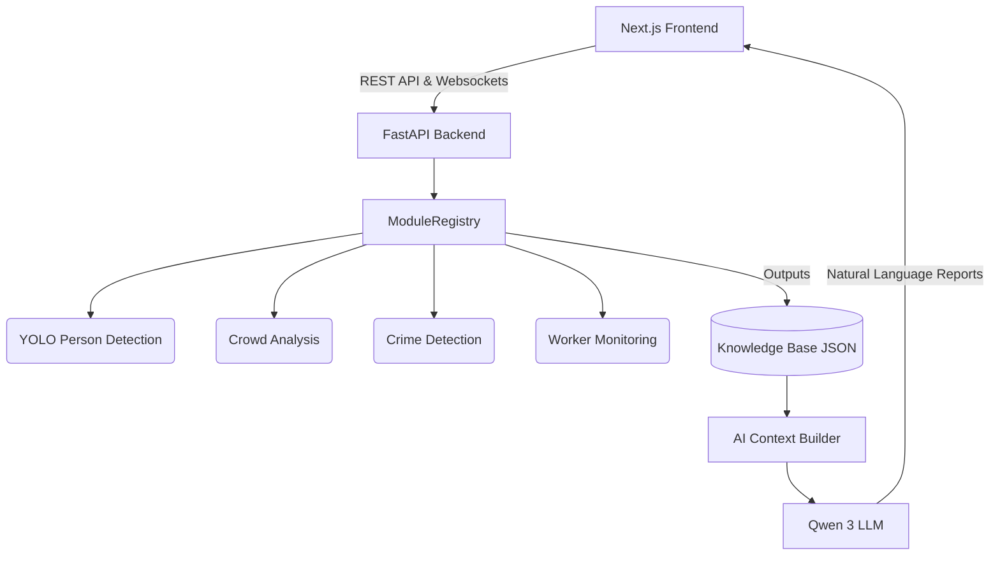

# RailVision AI — System Overview

## 1. Introduction
RailVision AI is an advanced, hardware-accelerated computer vision and natural language analytics platform tailored for railway station monitoring and security. 

It aims to replace legacy CCTV monitoring with a proactive AI system that can track crowds, identify criminals, monitor railway workers, detect anomalies, and summarize all of this intelligence into human-readable executive reports using an integrated LLM.

---

## 2. High-Level Architecture

The project adopts a decoupled, modern web architecture:

- **Frontend**: A highly optimized **Next.js 16** React application. It uses **Zustand** for global state management (specifically highly-performant slice-based updates) and features heavy use of **GSAP** and **Framer Motion** for a premium, cinematic user experience.
- **Backend AI Engine**: A Python-based **FastAPI** application acting as the central orchestrator. It manages the REST API endpoints and orchestrates the inference loops through a custom `ModuleRegistry`.

---

## 3. Technology Stack

### Application & API Layer
- **Python 3.13** (Backend Core)
- **FastAPI / Uvicorn** (REST APIs)
- **TypeScript / React 19 / Next.js 16** (Frontend)

### Core AI Models
- **YOLO26 / YOLOv11**: High-speed object detection and tracking.
- **Qwen 3 (8B)**: Locally run Large Language Model used as the "AI Master" for generating intelligence reports without sending sensitive surveillance data to the cloud.

### Infrastructure & Optimization
- **Hardware Acceleration**: The backend dynamically routes tensor math to NVIDIA CUDA (if available) or Apple Silicon Metal Performance Shaders (MPS), falling back to CPU.
- **Frame-Skipping Optimization**: Achieves a 50-66% reduction in GPU cycles by running full inference only on keyframes, while maintaining the output video stream at 30fps.
