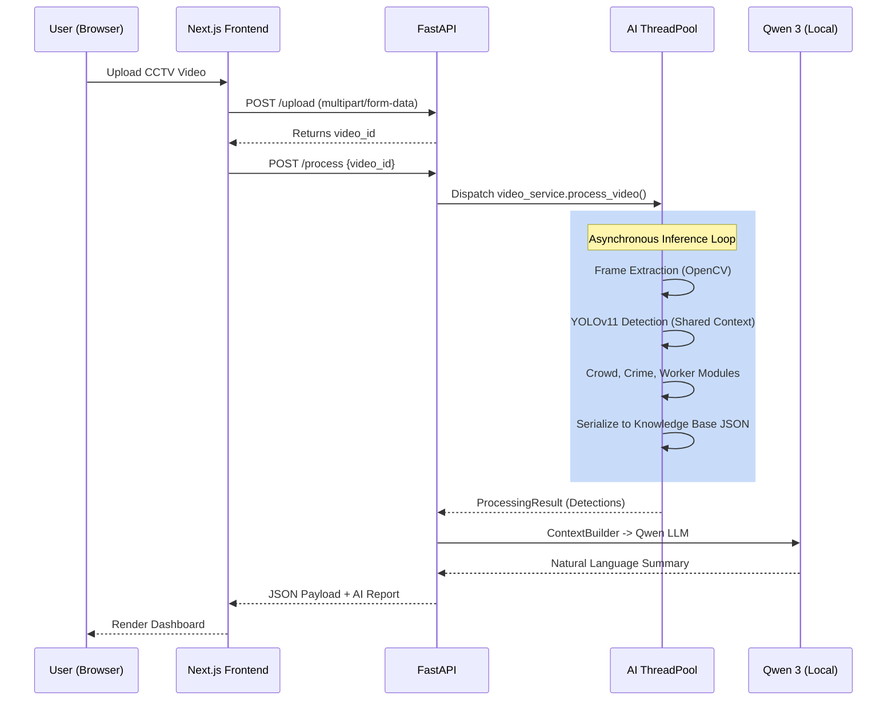

# System Architecture

## Overview
The RailVision AI system is designed with a strict decoupling of the presentation layer and the AI inference engine. This ensures the frontend remains at a fluid 60FPS while the backend GPU/CPU cranks through heavy tensor operations.

## Detailed Architecture Flow

## AI Inference Pipeline (`video_service.py`)
1. **Frame Extraction**: OpenCV reads the raw `.mp4`.
2. **Frame Skipping Optimization**: [IMPLEMENTED] The `frame_skip` config (default 3) forces the pipeline to only run heavy YOLO inference on every 4th frame. Missing frames hold the previous bounding boxes, cutting compute by ~66% without visually sacrificing 30fps smoothness.
3. **Module Registry Execution**: The `ModuleRegistry` acts as a Singleton orchestrator. It passes the current frame to the `PersonDetectionModule` (YOLO) first. The resulting bounding boxes are saved to `shared_context["detections"]`.
4. **Shared Context Optimization**: Subsequent modules (`CrowdAnalysis`, `CrimeDetection`) do not run YOLO again. They read `shared_context["detections"]` directly, saving massive overhead.
