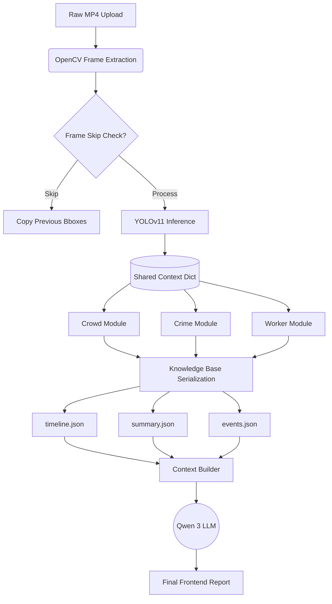

# Data Flow Architecture

The journey of a video frame from raw pixels to natural language intelligence:

## Knowledge Base Translation
The most critical part of this flow is **J -> K,L,M**. Raw pixel coordinates mean nothing to an LLM. The AI modules must translate geometric data (e.g., "Box moved 50px right over 3 seconds") into semantic data (e.g., "Person loitering in Zone A") before it is written to the JSON logs.
