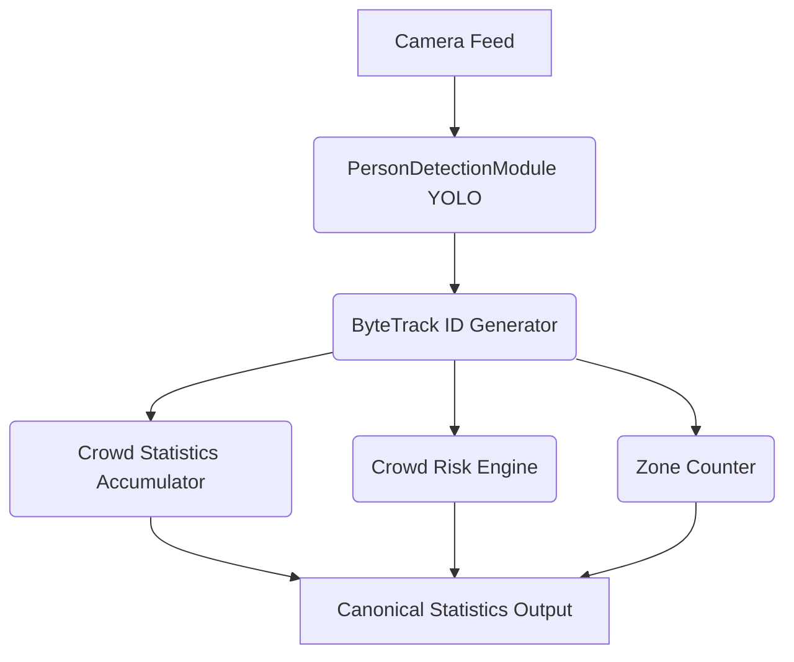

# RailVision AI — Crowd Analysis Architecture

## Purpose
The Crowd Analysis module tracks the movement, density, and risk levels of crowds across railway infrastructure in real-time. It provides structural summaries (averages, peaks, minimums) and contextual LLM insights without requiring the raw bounding-box level video data.

## Architecture & Data Flow


## Canonical JSON Schema
The crowd analysis engine exports a single unified `crowd.json` schema consumed natively by the React Dashboard, the Python WebSocket backend, and the Qwen Knowledge Base:
```json
{
    "current": 45,
    "average": 38.5,
    "peak": 92,
    "minimum": 12,
    "unique_tracks": 145,
    "density": "MEDIUM",
    "occupancy": 46.0,
    "risk": "NORMAL",
    "peak_timestamp": 120,
    "trend": []
}
```

## Mathematical Definitions
- **Current**: Absolute person count extracted strictly from the *most recently evaluated* AI frame.
- **Average**: Arithmetic mean of person counts from *only* AI-evaluated frames. Skipped frames (e.g., via `frame_skip` or webcam `analytics_skip`) do not inject `0` into this calculation.
- **Peak / Minimum**: Absolute maximum and minimum valid person counts observed at any frame during the session.
- **Unique Tracks**: The distinct number of unique `ByteTrack` IDs identified during the session. Represents unique physical humans passing through, not just frame-level bounding boxes.

## Risk & Density Engine
Density thresholds act as the foundational semantic mapping from raw numerical counts to human-readable statuses.

### Density Thresholds
- **LOW**: ≤ 50 people
- **MEDIUM**: ≤ 100 people
- **HIGH**: ≤ 200 people
- **CRITICAL**: > 200 people

### Risk Thresholds
- **NORMAL**: ≤ 50 people
- **MEDIUM**: ≤ 100 people
- **HIGH**: ≤ 200 people
- **CRITICAL**: > 200 people

*Note: Qwen is strictly instructed that a CRITICAL numerical density alone does not mathematically confirm a panic or crime event.*

## Active Alert Logic
The `CrowdAlertService` generates contextual alerts when specific triggers are met. To prevent alert spam on oscillating crowd numbers, a temporal lock (`self._fired`) is utilized so each class of event fires at most once per video session.

- **High Density**: Triggers when `count >= 60` AND density reaches HIGH.
- **Critical Density**: Triggers when `count >= 100` AND density reaches CRITICAL.
- **Congestion**: Triggers when `count >= 80`.
- **Stampede Risk**: Triggers when `count >= 120`.

## Frame Skip & Webcam Throttling
- **Uploaded Video (`frame_skip = 3`)**: Only every 4th frame is parsed by YOLO. The intermediate frames are discarded mathematically, ensuring the `average` metric accurately reflects true sampled conditions.
- **Webcam Real-Time (`analytics_skip = 3`)**: YOLO analyzes *every* frame to maintain smooth `unique_tracks` IDs, but heavy analytics (Zone counting, Density grading, Trend storage) execute only every 3rd frame.
